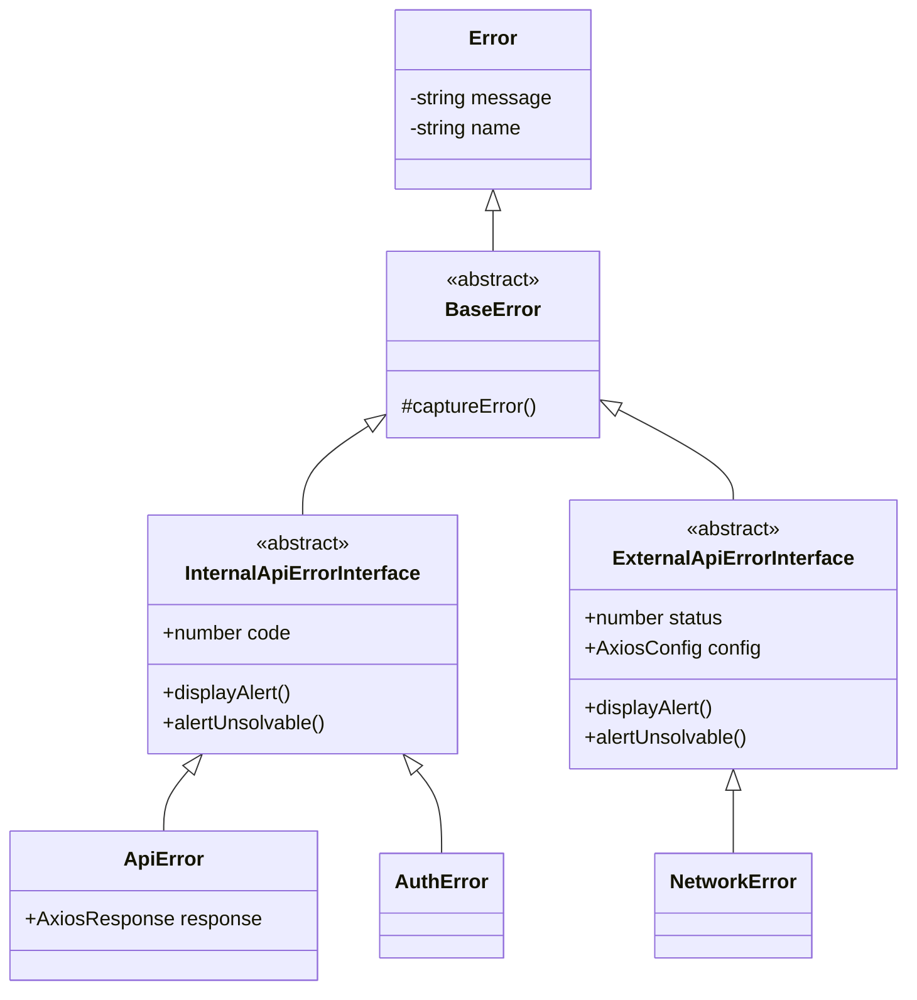

23년 7월, 이직 후 새로운 팀 새로운 프로젝트에 합류했다. 핵심 기능까지만 구현된 기존 코드베이스를 살피다가 아쉬운 점 몇 개를 발견할 수 있었는데 그 중 하나가 바로 에러 처리였다.

프론트엔드 팀 내에서 아직 구체적인 에러 처리 방안을 고민해보지 못한 상황이었다. 성공하는 상황만 가정하고 짜여진 코드였다. 여기까지는 납득할 수 있었다. 그런데 API 오류가 HTTP status(400, 500 등)로 구분되지 않았다. 성공이든 실패든 항상 200 OK로 내려오고, 응답 body의 result 값으로 성공 여부를 판별해야 했다. (1이면 성공, 그 외면 실패)  이 점을 이해할 수가 없었다

이 글은 내가 어떻게 팀원들을 설득했는지, 그리고 그 환경에서 에러 처리를 어떻게 설계했는지를 다룬다.

---
## 프론트엔드가 떠안게 되는 비용

### 문제1) 라이브러리 호환성

서버 에러가 200 OK로 내려오면 프론트엔드가 치르는 비용이 꽤 크다. Axios, React Query, Error Boundary, Next.js를 비롯한 많은 라이브러리/프레임워크가 HTTP status를 기준으로 성공/실패를 판단한다. 200번대는 성공, 4~500번대는 에러. 이 기준에 맞추려면 "비록 200으로 내려왔지만 이건 성공이 아니라 오류야!"라고 구차하게 설명해주는 과정이 반드시 동반되어야 한다.

### 문제 2) 내부 에러와 외부 에러

그 과정을 Axios interceptor가 담당하게 되는데, 여기서 불필요한 복잡함이 가중된다. 200 OK지만 result !== 1인 응답은 fulfilled 콜백에서 들어오고, 네트워크 오류나 실제 4xx/5xx는 rejected 콜백에서 들어온다. 에러의 진입 경로가 두 갈래인 이상, 내부 에러와 외부 에러를 나눠서 다룰 수밖에 없었다.

### 문제 3) 에러유형 분류의 어려움

에러를 두 종류로 분리해서 관리해도 불편함은 여전했다. HTTP status가 제공하는 분류 기준 자체가 없었기 때문이다. 백엔드가 내려주는 `error code`는 도메인 기반 번호 체계였다. 1000번대는 계정, 2000번대는 캠페인, 3000번대는 견적 관련 오류. HTTP status가 있었다면 401은 로그인 페이지로, 403은 권한 안내로, 404는 리디렉션으로. 이런식의 일괄 처리가 가능했을 것이다. 하지만 모든 에러가 200 OK에  에러코드로 내려오는 구조에서는 수백 개의 코드를 하나하나 까봐야 그게 인증 문제인지 입력 문제인지 알 수 있었다. 백엔드의 에러 코드 문서를 보고 일일이 하나씩 매핑해야 하는 구조였다. 지속 가능한 방식이 아니었다.

### 그렇게 나온 설계



불합리함 속에서 피어난 에러 객체 구조는 대략 이런 형태였다. 내부 에러와 외부 에러 추상 클래스를 두고 하위에 구현체를 배치했다. Axios response interceptor에서 fulfilled 콜백에선 내부 에러를, rejected 콜백에선 외부 에러를 분류해야 했다는 구조적 제약이다.

불합리함속에서 피어난 에러 객체 구조는 위와 같았다. 내부 에러와 외부 에러 추상 클래스를 두고 하위에 구현체를 배치했다. HTTP 401 인증 오류를 별도 처리하기 위해`AuthError`를, 외부 에러 유형으로 `NetworkError`를 명시했다. Axios response interceptor에서 fulfilled 콜백에선 내부 에러를, rejected 콜백에선 외부 에러를 분류했다.

Interceptor에서 에러로 분류해주는 로직은 다음과 같았다.

```typescript
// fulfilled: HTTP 200이지만 result !== 1이면 에러로 처리
const handleInternalErrorsOnFulfilledCallback = (response: AxiosResponse) => {
  const { result, msg } = response.data;

  if (result !== 1 /* SUCCESS */) {
    if (isDomainException(result)) return response; // 도메인 예외가 공통 레이어에 침투
    if (isAuthError(result)) {
      throw new AuthError(msg, result);
    }
    throw new ApiError(response);
  }
  return response;
};

// rejected: 2xx 밖 에러를 분류
const handleExternalErrorsOnRejectedCallback = (err: Error) => {
  if (isNetworkError(err)) {
    throw new NetworkError(err);
  }
  throw err;
};
```

코드를 처음 보는 사람은 이 구조에서 당황하게 된다. `fulfilled` 콜백, 즉 '성공했을 때 실행되는 함수'  안에서 `throw`를 하고 있다. "성공인데 왜 throw를 하지?" 하는 의아함이 생기는 순간 200 OK 남용의 전말을 설명해야 한다.

isAuthError와 isDomainException은 불합리함의 산물이다. 백엔드가 HTTP Status로 해줬어야 할 분류를 프론트엔드가 직접 해야 했다. 에러 코드를 하나하나 읽고 '이건 인증 오류야', '이건 에러가 아니라 도메인 예외야' 이런 판단을 공통 Interceptor에 심어야 했다. 앞서 말했듯이 지속 불가능한 방법이다. 다만 임시방편으로 꼭 필요한 부분에 한해서 하나씩 일일이 추가할 수밖에 없었다. 

> [!question] 어쩌다가 200 OK로 내려오게 됐을까
> 합류한 지 얼마 안 된 팀원이 "왜 그랬어요?" 하며 취조할 수는 없는 노릇이었다. 정황상 백엔드는 에러 응답 처리의 복잡성을 줄이고 싶었던 것 같고, 프론트는 이런 불편함을 예상하지 못했던 것 같다.
>
>  이러한 관례는 한국 전자정부 시큐어 코딩 가이드의 잘못된 현장 해석에서 비롯되었다고 한다. 가이드의 실제 의도는 에러 응답에 스택 트레이스나 DB 정보 같은 민감 정보를 담지 말라는 것(CWE-209)인데, 현장에서 "HTTP 상태코드 자체를 숨겨야 한다"로 확대 해석된 사례가 종종 있었다고 한다. 올바른 대응은 HTTP status는 의미에 맞게 쓰고, 응답 body에서 민감 정보만 제거하는 것이다.

## 설득, 그리고 결과

 합류 초기부터 에러 응답 구조에 대해 질문을 이어갔다. 충분히 파악한 뒤 백엔드 팀에 문제를 제기했다. 옳고 그름이 비교적 명확했다. 백엔드도 안티패턴이라고 수긍했다. 덕분에 문제를 제기한 것만으로 설득이 됐다.

설득은 수월했다. 옳고 그름이 비교적 명확한 상황이었다. 문제를 제기했을 때 백엔드도 안티패턴이라고 금새 수긍해주었다. 다만 이미 어느정도 진행된 서비스의 구조를 갈아엎는 것 보다는 프론트쪽에서 수고해주는 게 낫겠다는 결론이 내려졌다. 대신 다음 프로젝트부터HTTP status를 올바르게 사용하기로 합의했다.

이 문제 이후에도 적극적으로 의견을 내어 비효율을 개선해나갔다. 타입 추론이 제대로 되질 않았던 API Schema 구조를 손보고 zod를 도입해서 런타임 안정성을 강화했다. 코드 가독성을 위해서 React 18의 선언형 패러다임(`<ErrorBoundary>`, `<Suspense>`)을 적용했다. 이 때 fallback UI 처리를 위해서 데이터 요청결과가 빈 값일 때 실패가 아닌 성공으로 간주되게끔 백엔드에 변경을 요청했다. ([데이터가 없을 때 200인가 404인가?](https://techblog.yogiyo.co.kr/%EB%8D%B0%EC%9D%B4%ED%84%B0%EA%B0%80-%EC%97%86%EC%9D%84-%EB%95%8C-200%EC%9D%B8%EA%B0%80-404%EC%9D%B8%EA%B0%80-f1c8c39ca9df))

이것들은 3년이 지난 지금까지도 팀 내에 표준으로 자리매김하여 잘 쓰이고 있다. 내 업무 환경에서 체감되는 비효율을 하나씩 개선하고자 부단히 노력한 것들이 팀원들에게 받아들여지고 모두를 조금씩 편리하게 해준 셈이라고 생각한다. 

---

에러 설계에 있어 중요한 지점은 에러 객체 구조를 짜는 게 아니라 에러의 흐름을 통제하는 것이다. Server side/Client side에서 에러가 발생할 때, 그리고 Server Action, RSC, proxy, useQuery, useMutation과 같은 다양한 상황에서 발생하는 에러가 어디에서 어떻게 처리되는지. 이 핵심 부분은 별도 글에서 이어가보겠다.

